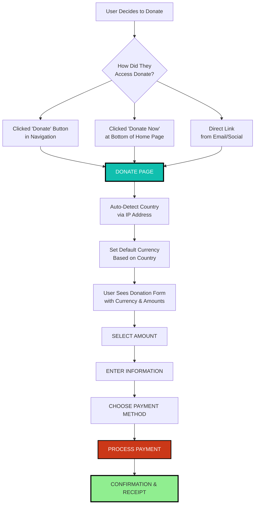
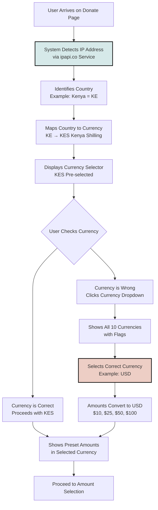
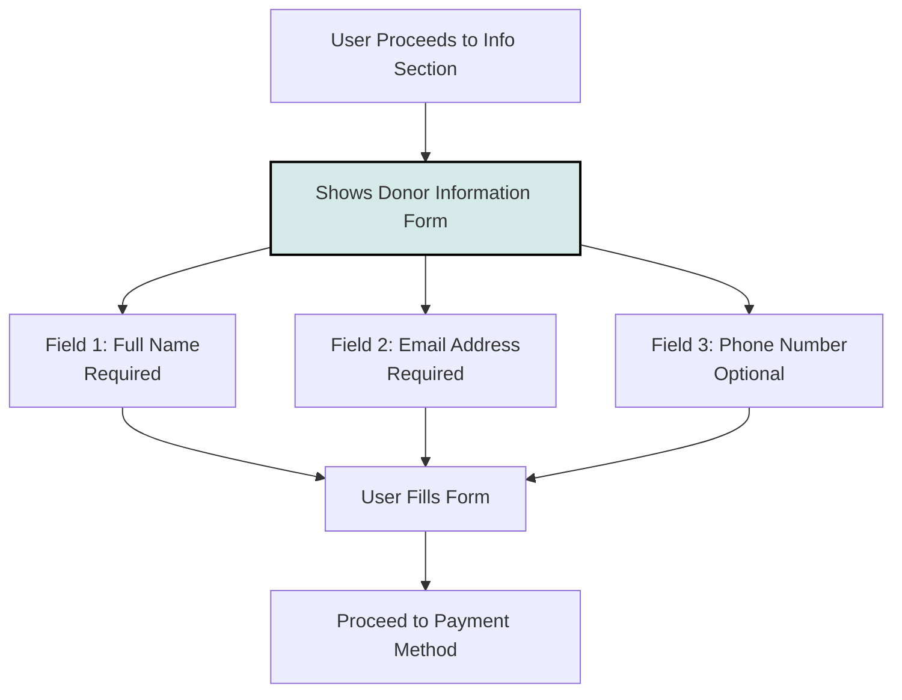
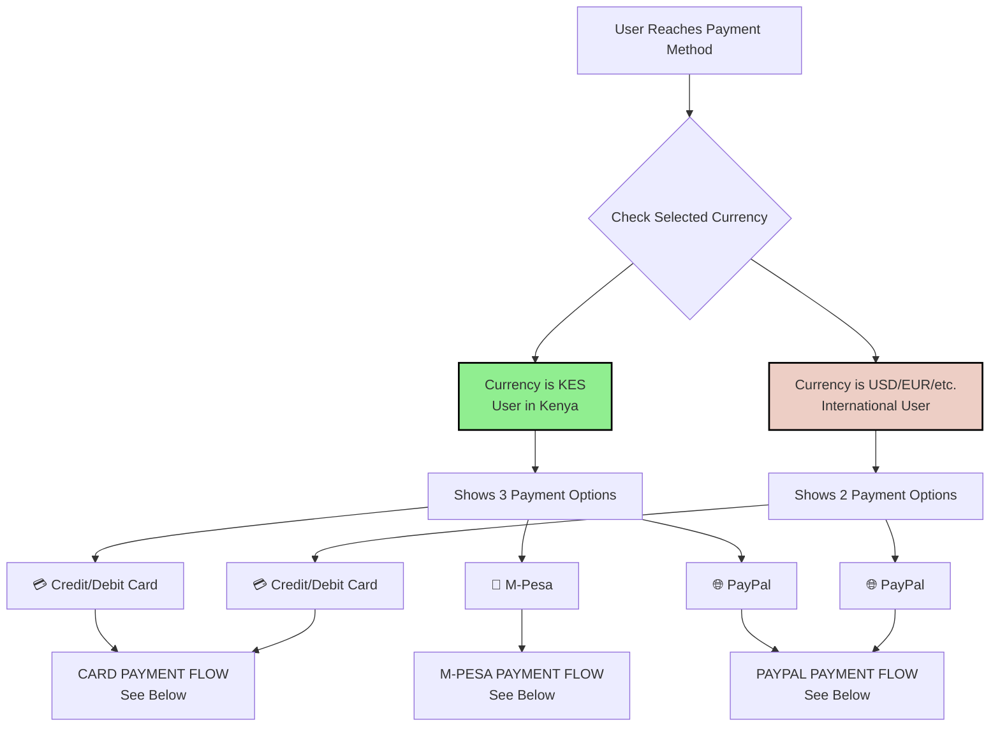
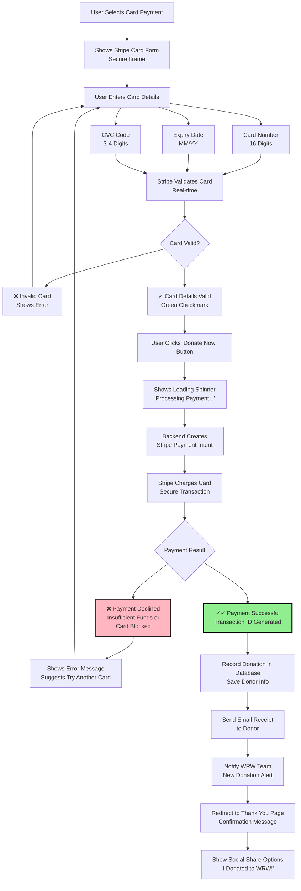
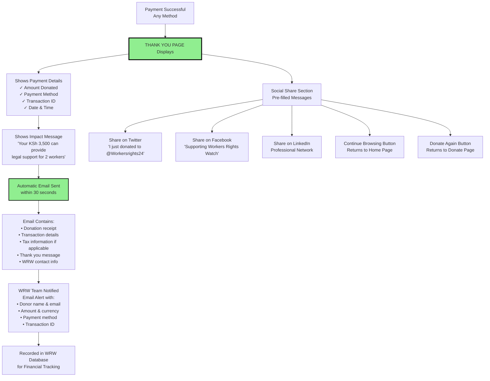
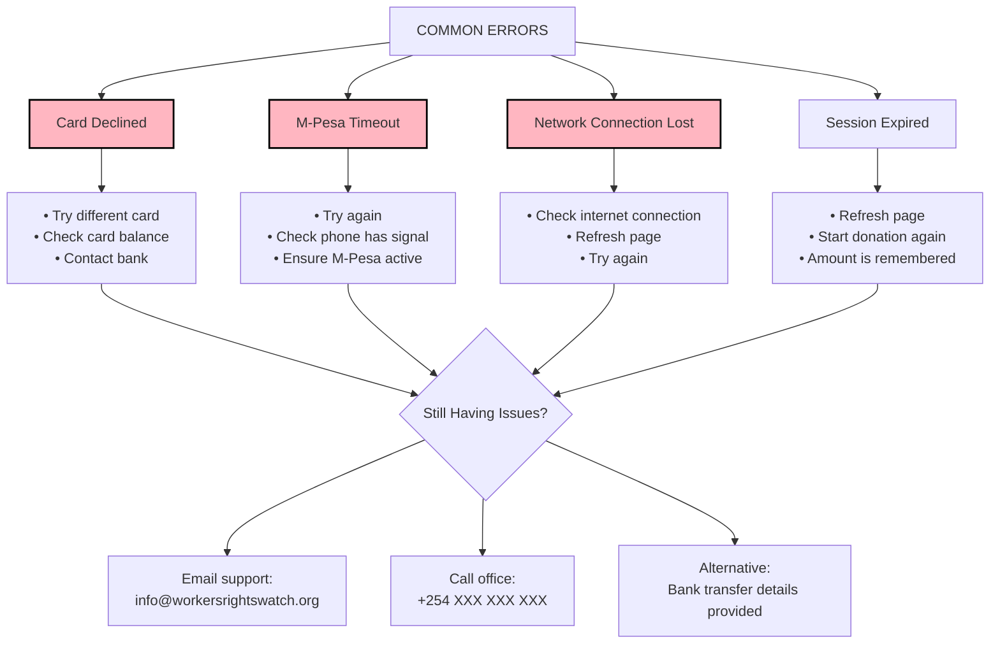
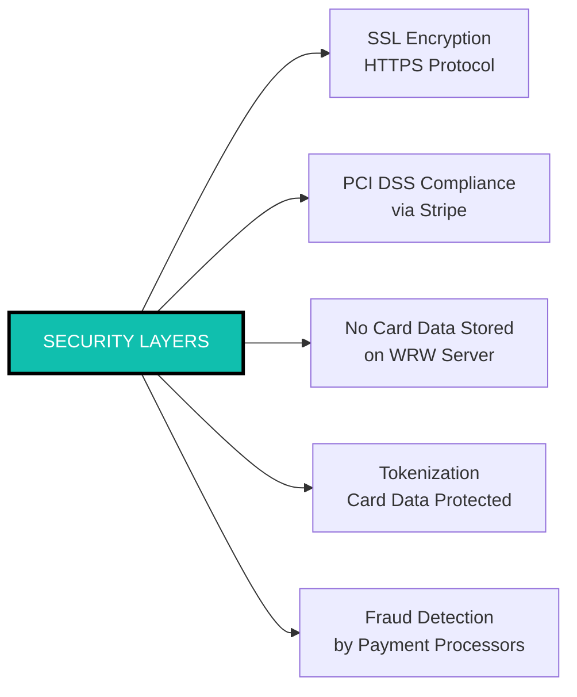
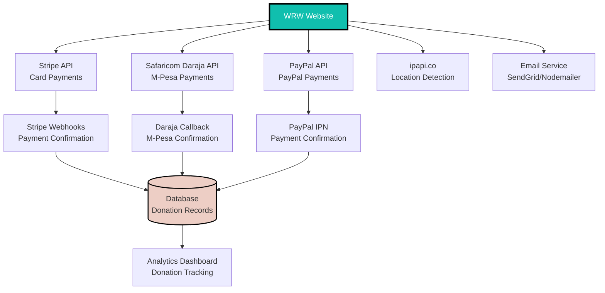

# Workers Rights Watch Website - Donation System Flow

## Complete Donation Process (When Active)

This document details the step-by-step donation process for all payment methods.

---

## High-Level Donation Flow



---

## Step 1: Currency Detection & Selection



**Supported Currencies:**
1. USD ($) - US Dollar
2. KES (KSh) - Kenyan Shilling  
3. EUR (€) - Euro
4. GBP (£) - British Pound
5. NGN (₦) - Nigerian Naira
6. ZAR (R) - South African Rand
7. CAD (C$) - Canadian Dollar
8. AUD (A$) - Australian Dollar
9. INR (₹) - Indian Rupee
10. JPY (¥) - Japanese Yen

---

## Step 2: Amount Selection

```mermaid
graph TD
    Start[User Sees Amount Options] --> PresetOptions[4 Preset Amount Buttons<br/>Example in KES:<br/>KSh 1,000 | 2,500 | 5,000 | 10,000]
    
    PresetOptions --> UserChoice{User Clicks Option}
    
    UserChoice --> SelectPreset[Clicks Preset Amount<br/>Example: KSh 2,500]
    SelectPreset --> HighlightButton[Button Highlights<br/>Teal Background]
    HighlightButton --> AmountSet[Amount Set to 2,500]
    
    UserChoice --> SelectCustom[Clicks 'Custom Amount']
    SelectCustom --> ShowInput[Shows Input Field<br/>with Currency Symbol]
    ShowInput --> TypeAmount[User Types Amount<br/>Example: 3500]
    TypeAmount --> ValidateAmount{Validate Amount}
    
    ValidateAmount --> TooLow[Amount < Minimum<br/>Shows Error: Min KSh 100]
    TooLow --> TypeAmount
    
    ValidateAmount --> ValidAmount[Valid Amount<br/>3,500 Accepted]
    ValidAmount --> AmountSet
    
    AmountSet --> DisplayTotal[Shows Total<br/>'You are donating: KSh 3,500']
    
    DisplayTotal --> ConvertNote[Note Shown:<br/>'Approximately $27 USD']
    
    ConvertNote --> Step3[Proceed to Donor Information]
    
    style AmountSet fill:#90EE90,stroke:#000,stroke-width:2px
    style TooLow fill:#FFB6C1,stroke:#000,stroke-width:2px
```

---

## Step 3: Donor Information



**Form Fields:**
- **Full Name** (Required): For receipt and thank you
- **Email Address** (Required): For receipt delivery
- **Phone Number** (Optional): For updates and M-Pesa

---

## Step 4: Payment Method Selection



**Why M-Pesa Only for KES:**
- M-Pesa is Kenya-specific mobile money
- Only works with Kenyan Shilling (KES)
- Requires Kenyan phone number (07xx or 01xx)

---

## Payment Flow A: Credit/Debit Card (Stripe)



**Processing Time:** 2-5 seconds  
**Supported Cards:** Visa, Mastercard, American Express, Discover  
**Security:** PCI DSS compliant via Stripe

---

## Payment Flow B: M-Pesa (Kenya Only)

```mermaid
graph TD
    Start[User Selects M-Pesa] --> ShowMpesaForm[Shows M-Pesa Form<br/>Phone Number Field]
    
    ShowMpesaForm --> EnterPhone[User Enters Phone Number<br/>Example: 0712345678]
    
    EnterPhone --> ValidatePhone{Validate Phone}
    
    ValidatePhone --> InvalidPhone[❌ Invalid Format<br/>Shows Error:<br/>'Enter valid 07xx or 01xx']
    InvalidPhone --> EnterPhone
    
    ValidatePhone --> ValidPhone[✓ Valid Phone Number<br/>Formats to 254712345678]
    
    ValidPhone --> ReviewDetails[User Reviews:<br/>• Amount: KSh 3,500<br/>• Phone: 0712345678]
    
    ReviewDetails --> ClickPay[User Clicks<br/>'Complete Donation via M-Pesa']
    
    ClickPay --> ShowWaiting[Shows Message:<br/>'Check your phone for<br/>M-Pesa prompt']
    
    ShowWaiting --> BackendCall[Backend Calls<br/>Safaricom Daraja API]
    
    BackendCall --> STKPush[Sends STK Push<br/>to User's Phone]
    
    STKPush --> PhonePrompt[📱 User's Phone Receives<br/>M-Pesa Payment Prompt]
    
    PhonePrompt --> UserDecision{User Action on Phone}
    
    UserDecision --> Cancel[User Cancels Prompt<br/>or Ignores (Timeout)]
    Cancel --> ShowCancelMsg[Shows: 'Payment Cancelled<br/>Please try again']
    ShowCancelMsg --> ReviewDetails
    
    UserDecision --> EnterPIN[User Enters M-Pesa PIN<br/>Confirms Payment]
    
    EnterPIN --> MpesaProcess[M-Pesa Processes Payment<br/>Checks Balance]
    
    MpesaProcess --> MpesaResult{M-Pesa Result}
    
    MpesaResult --> InsufficientFunds[❌ Insufficient Balance<br/>Payment Failed]
    InsufficientFunds --> ShowErrorMsg[Shows: 'Insufficient M-Pesa Balance<br/>Please top up and try again']
    ShowErrorMsg --> ReviewDetails
    
    MpesaResult --> MpesaSuccess[✓✓ Payment Successful<br/>M-Pesa Confirmation]
    
    MpesaSuccess --> UserSMS[User Receives SMS<br/>from M-Pesa<br/>'You paid KSh 3,500 to WRW']
    
    MpesaSuccess --> WebhookCall[Safaricom Sends Webhook<br/>to WRW Backend]
    
    WebhookCall --> VerifyPayment[Backend Verifies Payment<br/>Matches Transaction ID]
    
    VerifyPayment --> RecordDB[Record Donation in Database]
    
    RecordDB --> SendReceipt[Send Email Receipt<br/>to Donor]
    SendReceipt --> NotifyWRW[Notify WRW Team<br/>New Donation Alert]
    
    NotifyWRW --> ThankYouPage[Show Success Page<br/>'Thank You!<br/>KSh 3,500 Received']
    
    ThankYouPage --> ShareOptions[Social Share Options<br/>'I Donated to WRW!']
    
    style MpesaSuccess fill:#90EE90,stroke:#000,stroke-width:3px
    style InsufficientFunds fill:#FFB6C1,stroke:#000,stroke-width:2px
    style Cancel fill:#FFB6C1,stroke:#000,stroke-width:2px
```

**Processing Time:** 10-30 seconds (depends on user response)  
**User Experience:** 
1. Receives prompt on phone within 5 seconds
2. Enters M-Pesa PIN to confirm
3. Gets SMS confirmation from M-Pesa
4. Sees success message on website

**Common Issues & Solutions:**
- **No prompt received:** User should check network connection
- **Prompt timeout:** Can try again immediately
- **Wrong PIN:** User must re-enter correct PIN
- **Insufficient balance:** User should top up M-Pesa and retry

---

## Payment Flow C: PayPal

```mermaid
graph TD
    Start[User Selects PayPal] --> ReviewAmount[User Reviews Donation Amount<br/>$25 USD]
    
    ReviewAmount --> ClickPayPal[Clicks 'Donate with PayPal' Button]
    
    ClickPayPal --> ShowProcessing[Shows: 'Redirecting to PayPal...'<br/>Loading Spinner]
    
    ShowProcessing --> BackendCall[Backend Creates<br/>PayPal Order]
    
    BackendCall --> GetApprovalURL[Gets PayPal Approval URL<br/>from PayPal API]
    
    GetApprovalURL --> RedirectUser[Redirects User to PayPal.com]
    
    RedirectUser --> PayPalPage[User Sees PayPal Page<br/>Secure Payment Gateway]
    
    PayPalPage --> LoginChoice{PayPal Login Choice}
    
    LoginChoice --> HasAccount[Has PayPal Account<br/>Clicks 'Log In']
    LoginChoice --> NoAccount[No PayPal Account<br/>Clicks 'Pay with Card']
    
    HasAccount --> LoginPayPal[Logs into PayPal<br/>Email + Password]
    LoginPayPal --> SelectSource[Selects Payment Source<br/>PayPal Balance or<br/>Linked Card/Bank]
    
    NoAccount --> GuestCheckout[Guest Checkout<br/>Enters Card Details on PayPal]
    GuestCheckout --> CardDetails[Enters Card Info<br/>Name, Number, Expiry, CVC]
    CardDetails --> SelectSource
    
    SelectSource --> ReviewPayPal[Reviews Payment on PayPal<br/>Amount, Recipient: WRW]
    
    ReviewPayPal --> ConfirmPayment[Clicks 'Complete Payment'<br/>on PayPal]
    
    ConfirmPayment --> PayPalProcess[PayPal Processes Payment]
    
    PayPalProcess --> PayPalResult{Payment Result}
    
    PayPalResult --> PayPalFailed[❌ Payment Failed<br/>Card Declined or Error]
    PayPalFailed --> ShowPayPalError[Shows Error on PayPal<br/>Option to Try Again]
    ShowPayPalError --> SelectSource
    
    PayPalResult --> PayPalSuccess[✓✓ Payment Successful<br/>PayPal Transaction Complete]
    
    PayPalSuccess --> RedirectBack[PayPal Redirects Back<br/>to WRW Website]
    
    RedirectBack --> CapturePayment[Backend Captures Payment<br/>from PayPal]
    
    CapturePayment --> RecordDB[Record Donation in Database]
    
    RecordDB --> SendReceipt[Send Email Receipt<br/>to Donor]
    SendReceipt --> NotifyWRW[Notify WRW Team<br/>New Donation Alert]
    
    NotifyWRW --> ThankYouPage[Show Success Page<br/>'Thank You!<br/>$25 Received via PayPal']
    
    ThankYouPage --> ShareOptions[Social Share Options<br/>'I Donated to WRW!']
    
    style PayPalSuccess fill:#90EE90,stroke:#000,stroke-width:3px
    style PayPalFailed fill:#FFB6C1,stroke:#000,stroke-width:2px
```



**Processing Time:** 30-60 seconds (depends on login and confirmation)  
**Advantage:** Trusted payment platform, secure for international donors  
**User Experience:**
1. Redirected to PayPal secure site
2. Logs in or pays as guest
3. Confirms payment on PayPal
4. Returns to WRW website
5. Sees confirmation

---

## Confirmation & Receipt Flow



**Email Receipt Includes:**
- Donor name and email
- Donation amount and currency
- USD equivalent (for tax purposes)
- Payment method used
- Transaction/Reference ID
- Date and time of donation
- Thank you message
- Impact statement
- Tax deductibility information (if applicable)
- WRW contact information

---

## Error Handling & Support

### Common Errors & Solutions



---

## Security Measures

### Payment Security



**Security Features:**
1. **SSL/HTTPS:** All data encrypted in transit
2. **PCI Compliance:** Stripe handles card data securely
3. **No Storage:** Card details never touch WRW servers
4. **Tokenization:** Card data converted to secure tokens
5. **Fraud Detection:** Automatic fraud screening by Stripe/PayPal
6. **3D Secure:** Additional verification for international cards
7. **M-Pesa Security:** PIN-protected, SMS confirmation

---

## Donation Flow Summary

### Step-by-Step Checklist

| Step | Action | Time | Status Check |
|------|--------|------|--------------|
| 1 | Access Donate Page | Instant | Page loads |
| 2 | Auto-detect currency | 1-2 sec | Currency shown |
| 3 | Select amount | User choice | Amount highlighted |
| 4 | Enter donor info | 30-60 sec | Fields completed |
| 5 | Choose payment method | User choice | Method selected |
| 6 | Process payment | 3-60 sec | Loading shown |
| 7 | Confirm success | Instant | Green checkmark |
| 8 | Receive email | 30 sec | Email in inbox |
| **Total** | **End-to-end** | **2-5 min** | **Donation complete** |

### Success Rates (Industry Average)

- **Card Payments:** 95-97% success rate
- **M-Pesa:** 92-95% success rate
- **PayPal:** 96-98% success rate

### Donation Amounts (Expected Distribution)

- **Small ($5-25 / KSh 500-2,500):** 60% of donors
- **Medium ($26-100 / KSh 2,501-10,000):** 30% of donors
- **Large ($101+ / KSh 10,001+):** 10% of donors

---

## Backend Integration Points

### APIs & Services Used



### What Needs To Be Configured

**Before Launch Checklist:**

1. **Stripe Account**
   - [ ] Create Stripe business account
   - [ ] Complete KYC verification
   - [ ] Add bank account for payouts
   - [ ] Get Publishable Key
   - [ ] Get Secret Key
   - [ ] Test with test cards

2. **M-Pesa/Daraja**
   - [ ] Register for Daraja API at developers portal
   - [ ] Get Paybill or Till Number
   - [ ] Get Consumer Key
   - [ ] Get Consumer Secret
   - [ ] Set callback URL
   - [ ] Test with sandbox (test environment)
   - [ ] Move to production

3. **PayPal**
   - [ ] Create PayPal Business account
   - [ ] Complete verification
   - [ ] Get Client ID
   - [ ] Get Secret Key
   - [ ] Set return URLs
   - [ ] Test in sandbox
   - [ ] Switch to live

4. **Email Service**
   - [ ] Configure SendGrid or similar
   - [ ] Verify sender email (info@workersrightswatch.org)
   - [ ] Create receipt email template
   - [ ] Test email delivery

---

*This donation flow diagram provides complete understanding of how the payment system will work once activated. Share this with Madam Eunice to explain the process.*

