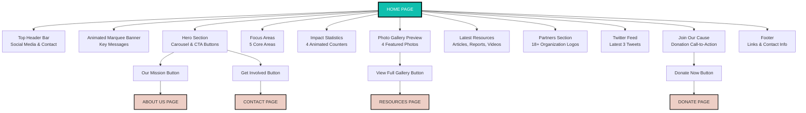
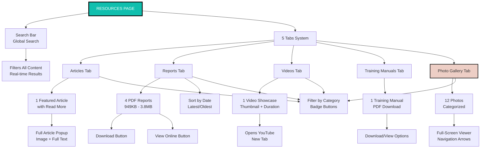
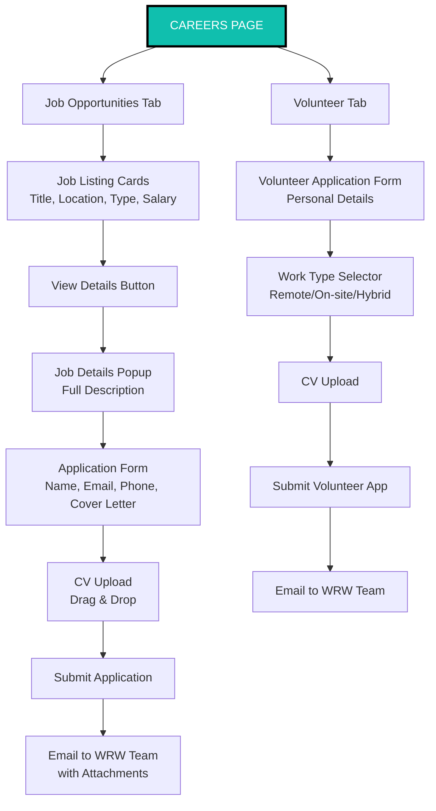
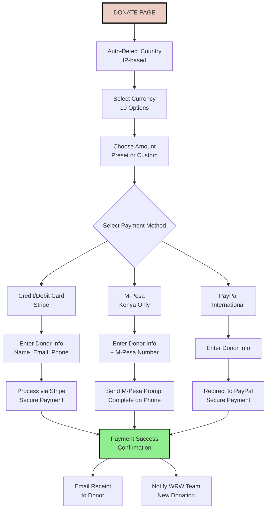
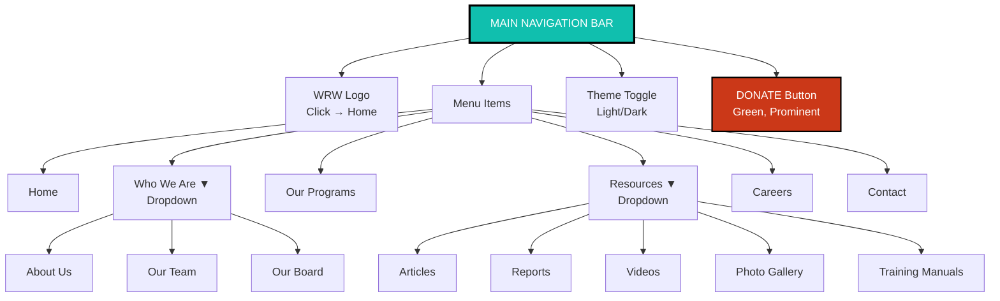
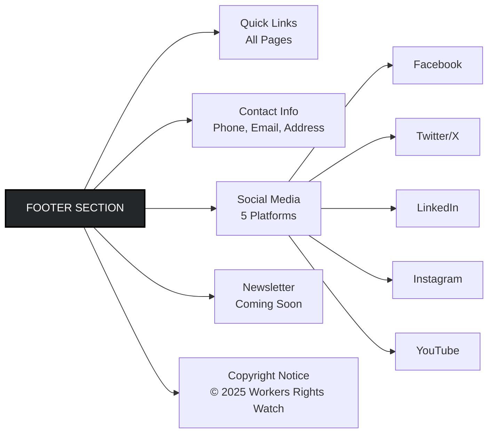
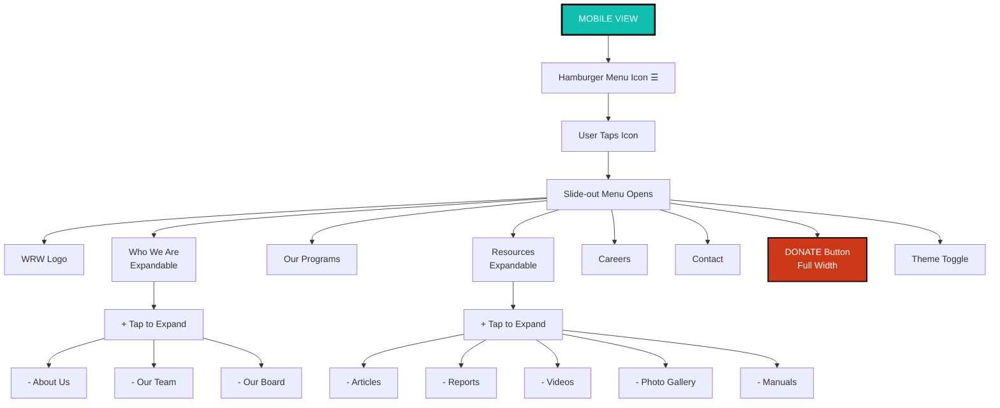
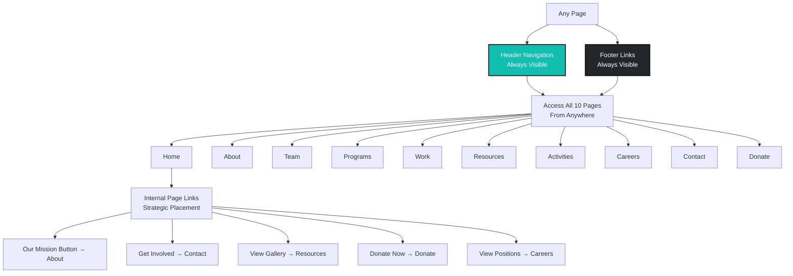

# Workers Rights Watch Website Structure

## Complete Site Map

This diagram shows how all pages connect and the main sections within each page.

```mermaid
graph TB
    Home[🏠 HOME PAGE<br/>Main Landing]
    
    Home --> About[📖 ABOUT US<br/>Vision, Mission, Values]
    Home --> Team[👥 OUR TEAM<br/>Leadership & Board]
    Home --> Programs[🎯 OUR PROGRAMS<br/>What We Do]
    Home --> Work[💼 OUR WORK<br/>How We Do It]
    Home --> Resources[📚 RESOURCES<br/>Knowledge Hub]
    Home --> Activities[🎉 ACTIVITIES<br/>Recent Events]
    Home --> Careers[💼 CAREERS<br/>Jobs & Volunteers]
    Home --> Contact[📞 CONTACT<br/>Get In Touch]
    Home --> Donate[💝 DONATE<br/>Support Us]
    
    style Home fill:#10bfae,stroke:#000,stroke-width:3px,color:#fff
    style About fill:#D6E9E9,stroke:#000,stroke-width:2px
    style Team fill:#D6E9E9,stroke:#000,stroke-width:2px
    style Programs fill:#D6E9E9,stroke:#000,stroke-width:2px
    style Work fill:#D6E9E9,stroke:#000,stroke-width:2px
    style Resources fill:#D6E9E9,stroke:#000,stroke-width:2px
    style Activities fill:#D6E9E9,stroke:#000,stroke-width:2px
    style Careers fill:#D6E9E9,stroke:#000,stroke-width:2px
    style Contact fill:#D6E9E9,stroke:#000,stroke-width:2px
    style Donate fill:#EDCEC5,stroke:#000,stroke-width:2px
```

---

## Detailed Page Structure

### Home Page Sections

### Resources Page Structure (Most Complex)

### Careers Page Structure

### Donate Page Flow (Under Construction)

---

## Navigation Hierarchy

---

## Footer Structure

---

## Mobile Navigation

---

## Information Architecture Summary

### Level 1: Top Navigation (10 Main Sections)
1. Home
2. Who We Are (3 sub-pages)
3. Our Programs
4. Our Work
5. Resources (5 sub-sections)
6. Activities
7. Careers (2 tabs)
8. Contact
9. Donate

### Level 2: Sub-Sections
- **Who We Are:** About Us, Our Team, Our Board (3 pages)
- **Resources:** Articles, Reports, Videos, Manuals, Photos (5 tabs)
- **Careers:** Jobs, Volunteers (2 tabs)
- **Our Team:** Leadership, Board (2 tabs)

### Total Pages: 10 main pages
### Total Sections: 20+ unique content sections
### Interactive Elements: 50+ (forms, galleries, popups, filters)

---

## Page Interconnectivity

---

*These diagrams can be viewed in any Markdown viewer that supports Mermaid diagrams (GitHub, VS Code, many documentation platforms).*

*For PDF conversion, screenshots of the rendered diagrams should be included.*

