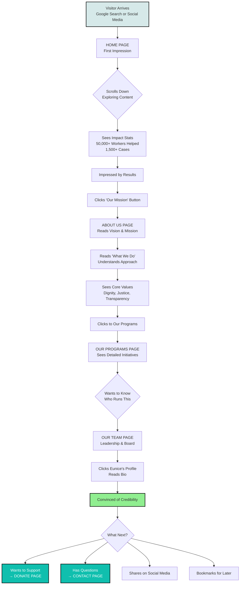
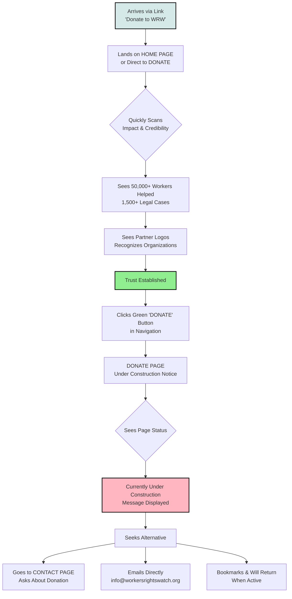
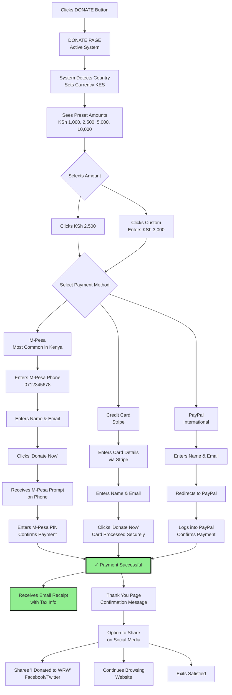
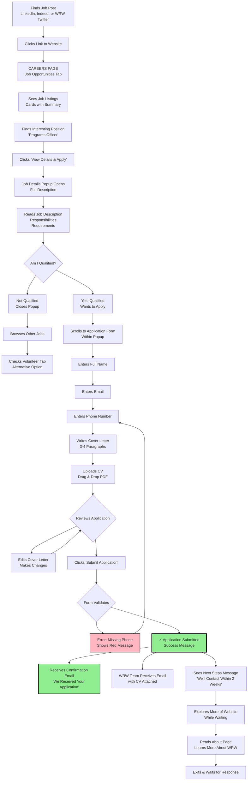
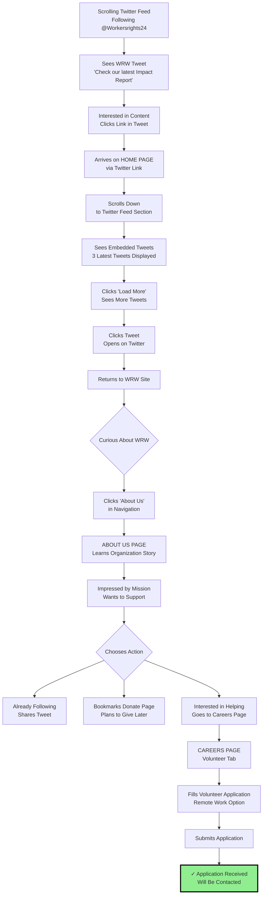
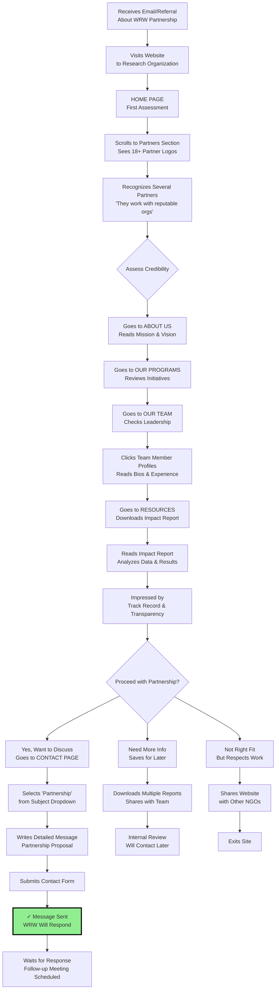
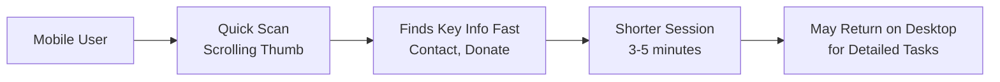
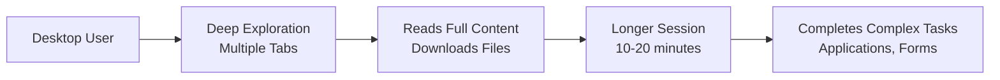

# Workers Rights Watch Website - User Journey Flows

## Different Types of Visitors & Their Journeys

This document shows how different people use the Workers Rights Watch website based on their goals.

---

## User Flow 1: First-Time Visitor Learning About WRW

**User Type:** Someone who heard about Workers Rights Watch and wants to learn more

**Time on Site:** 5-10 minutes  
**Pages Viewed:** 4-6 pages  
**Conversion Goal:** Donor, contact submission, or social share

---

## User Flow 2: Donor Who Wants to Contribute

**User Type:** Someone ready to donate (from social media, email campaign, or referral)

**Current Experience:** Donor cannot complete donation online yet  
**Future Experience (Once Active):** See "User Flow 2B" below

### User Flow 2B: Donor Experience (When Donation System is Active)

**Time on Site:** 3-5 minutes  
**Pages Viewed:** 1-2 pages  
**Conversion Goal:** Completed donation

---

## User Flow 3: Job Seeker Looking for Employment

**User Type:** Professional interested in working for WRW

**Time on Site:** 10-20 minutes  
**Pages Viewed:** 2-4 pages  
**Conversion Goal:** Job application submitted

---

## User Flow 4: Researcher Seeking Information

**User Type:** Student, journalist, or partner organization researching workers' rights in Kenya

```mermaid
graph TD
    Start[Google Search<br/>'workers rights Kenya report'] --> SearchResults[WRW Appears in Results<br/>Clicks Link]
    
    SearchResults --> LandsResources[Lands on RESOURCES PAGE<br/>Reports Tab]
    
    LandsResources --> SeeReports[Sees 4 PDF Reports<br/>with Cover Images]
    
    SeeReports --> BrowseOptions[Browses Report Titles<br/>& Descriptions]
    
    BrowseOptions --> Interest[Interested in<br/>'WRW Impact Report'<br/>3.8 MB PDF]
    
    Interest --> CheckSize[Checks File Size<br/>3.8 MB - Large but OK]
    
    CheckSize --> Decision{Download or View Online?}
    
    Decision --> ViewOnline[Clicks 'View Online'<br/>Opens in New Tab]
    ViewOnline --> ReadOnline[Reads Report Online<br/>in Browser PDF Viewer]
    ReadOnline --> Helpful{Found What Needed?}
    
    Decision --> Download[Clicks 'Download Report'<br/>PDF Downloads]
    Download --> OpenPDF[Opens PDF on Computer]
    OpenPDF --> ReadOffline[Reads Report<br/>Takes Notes]
    ReadOffline --> Helpful
    
    Helpful --> Yes[Yes, Very Useful]
    Helpful --> No[No, Needs More Info]
    
    Yes --> DownloadMore[Downloads Another Report<br/>'Sexual Harassment Report']
    DownloadMore --> CheckVideos[Checks Videos Tab<br/>Finds Documentary]
    CheckVideos --> WatchVideo[Clicks Play<br/>Opens YouTube Video]
    
    WatchVideo --> Satisfied[Gets Complete Picture<br/>of WRW Work]
    
    No --> UseSearch[Uses Search Bar<br/>Searches 'gender equality']
    UseSearch --> FilteredResults[Sees Filtered Results<br/>Across All Resource Types]
    FilteredResults --> FindsArticle[Finds Relevant Article<br/>Clicks 'Read More']
    FindsArticle --> ArticlePopup[Reads Full Article<br/>in Popup]
    ArticlePopup --> Satisfied
    
    Satisfied --> Contact{Needs Interview/More Info?}
    
    Contact --> YesContact[Goes to CONTACT PAGE<br/>Fills Form]
    YesContact --> SendsMessage[Sends Message<br/>'Media Request']
    SendsMessage --> Receives[Receives Confirmation<br/>WRW Will Respond]
    
    Contact --> NoContact[Has Enough Info<br/>Cites in Research]
    
    NoContact --> Bookmark[Bookmarks Resources Page<br/>For Future Reference]
    Bookmark --> Exit[Exits Satisfied]
    
    Receives --> Exit
    
    style Satisfied fill:#90EE90,stroke:#000,stroke-width:3px
    style Receives fill:#90EE90,stroke:#000,stroke-width:2px
```

**Time on Site:** 15-30 minutes  
**Pages Viewed:** 3-5 pages  
**Conversion Goal:** Downloaded resources, potential contact for interview

---

## User Flow 5: Worker Seeking Legal Help

**User Type:** Worker experiencing rights violations needing assistance

```mermaid
graph TD
    Start[Worker Hears About WRW<br/>from Colleague or Poster] --> Search[Searches on Google<br/>'workers rights help Kenya']
    
    Search --> FindsSite[Finds WRW Website<br/>Clicks Result]
    
    FindsSite --> Home[HOME PAGE<br/>Reads Headline]
    
    Home --> SeesFocus[Sees 'Legal Support'<br/>in Focus Areas]
    SeesFocus --> Hopeful[Feels Hopeful<br/>This Might Help]
    
    Hopeful --> ExploreOptions{Where to Find Help?}
    
    ExploreOptions --> NavPrograms[Clicks 'Our Programs'<br/>in Navigation]
    NavPrograms --> Programs[OUR PROGRAMS PAGE<br/>Reads Legal Aid Section]
    Programs --> SeesServices[Sees 'Free Legal Aid'<br/>'Case Representation']
    SeesServices --> NeedsContact[Needs to Contact WRW]
    
    ExploreOptions --> NavContact[Clicks 'Contact' in Nav<br/>Direct Approach]
    NavContact --> Contact[CONTACT PAGE<br/>Contact Form]
    
    NeedsContact --> Contact
    
    Contact --> ReadOptions[Sees Contact Options<br/>Form, Phone, Email]
    
    ReadOptions --> DecideMethod{Choose Contact Method}
    
    DecideMethod --> UseForm[Fills Contact Form]
    UseForm --> SelectSubject[Selects 'Legal Support'<br/>from Dropdown]
    SelectSubject --> EnterName[Enters Name]
    EnterName --> EnterEmail[Enters Email]
    EnterEmail --> EnterPhone[Enters Phone]
    EnterPhone --> WriteMessage[Writes Message<br/>Describes Situation]
    WriteMessage --> SubmitForm[Clicks 'Send Message']
    SubmitForm --> FormSuccess[✓ Message Sent<br/>Confirmation Shown]
    FormSuccess --> EmailConf[Receives Auto-Reply<br/>'We Received Your Message']
    EmailConf --> WRWGets[WRW Team Gets Email<br/>Will Respond Within 48hrs]
    
    DecideMethod --> CallPhone[Sees Phone Number<br/>Prefers to Call]
    CallPhone --> MakesCall[Calls WRW Office<br/>Speaks to Staff]
    MakesCall --> GetsHelp[Gets Immediate Info<br/>or Scheduled Appointment]
    
    DecideMethod --> SendEmail[Sees Email Address<br/>Sends Direct Email]
    SendEmail --> EmailSent[Emails from Personal Account<br/>Detailed Explanation]
    EmailSent --> WRWGets
    
    WRWGets --> WaitResponse[Worker Waits<br/>for Response]
    WaitResponse --> ResponseReceived[Receives Response<br/>within 48 Hours]
    ResponseReceived --> NextSteps[Gets Next Steps<br/>Meeting Scheduled or<br/>Referred to Lawyer]
    
    GetsHelp --> NextSteps
    
    NextSteps --> Assisted[Worker Gets Assistance<br/>Case Opens]
    
    style FormSuccess fill:#90EE90,stroke:#000,stroke-width:3px
    style Assisted fill:#90EE90,stroke:#000,stroke-width:3px
```

**Time on Site:** 5-10 minutes  
**Pages Viewed:** 2-4 pages  
**Conversion Goal:** Contact submission, phone call made

---

## User Flow 6: Social Media Follower

**User Type:** Someone who follows WRW on Twitter/X and clicks a link

**Time on Site:** 5-15 minutes  
**Pages Viewed:** 2-5 pages  
**Conversion Goal:** Deeper engagement, volunteer application, social share

---

## User Flow 7: Partner Organization Representative

**User Type:** Staff from partner NGO or potential partner exploring collaboration

**Time on Site:** 20-40 minutes  
**Pages Viewed:** 6-10 pages  
**Conversion Goal:** Partnership inquiry submitted

---

## User Flow Summary Table

| User Type | Entry Point | Primary Goal | Key Pages | Avg Time | Conversion |
|-----------|-------------|--------------|-----------|----------|------------|
| **First-Time Visitor** | Google, Social Media | Learn about WRW | Home, About, Team | 5-10 min | Donation or Contact |
| **Donor** | Email campaign, Social | Make donation | Home, Donate | 3-5 min | Completed donation |
| **Job Seeker** | LinkedIn, Indeed | Apply for job | Careers | 10-20 min | Job application |
| **Researcher** | Google search | Find information | Resources | 15-30 min | Downloaded reports |
| **Worker Seeking Help** | Word of mouth, Google | Get legal assistance | Home, Programs, Contact | 5-10 min | Contact submission |
| **Social Media Follower** | Twitter/X | Engage with content | Home, About | 5-15 min | Volunteer app, Share |
| **Partner Org** | Email, Referral | Assess partnership | All pages | 20-40 min | Partnership inquiry |

---

## Mobile vs Desktop User Behavior

### Mobile User (60-70% of visitors)

**Mobile Optimizations on Site:**
- Hamburger menu for easy navigation
- Large, tap-friendly buttons
- Optimized images load fast on 3G/4G
- Forms work well with phone keyboard
- Click-to-call phone numbers

### Desktop User (30-40% of visitors)

**Desktop Advantages:**
- Full navigation menu visible
- Multiple resource tabs open
- Easier form filling
- Better for reading long reports
- Side-by-side comparison

---

*These user flow diagrams help understand how different visitors navigate the website and achieve their goals. This informs future improvements and content updates.*

